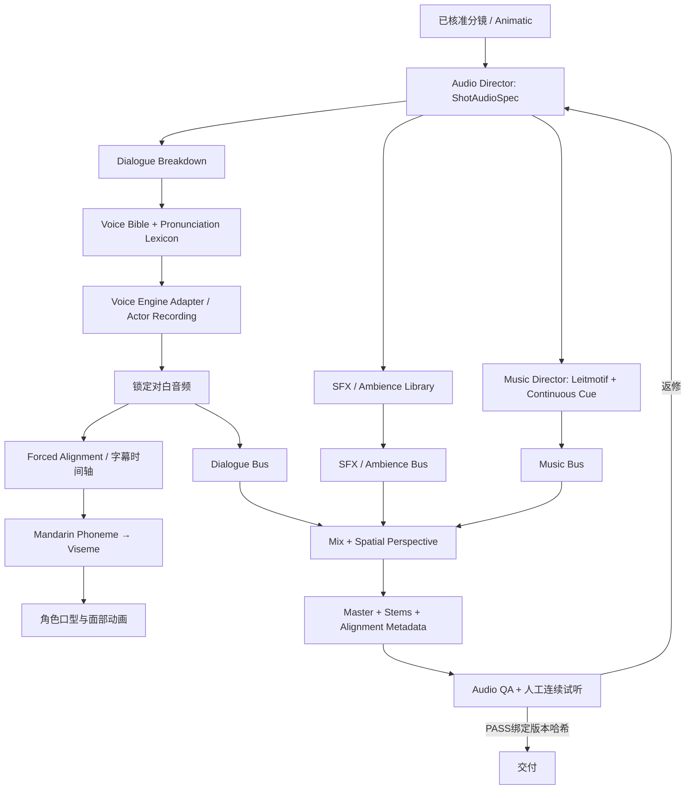

# 《从红月开始》Audio Bible / Audio Pipeline

**版本：** v0.1 · 音频制作规格草案

**范围：** 对白/配音、口型对齐、环境声/音效、配乐、混音、字幕与音频 QA。

**状态：** 首个 90 秒开场分镜暂不写人物对白；音色、主题动机和音效 ID 均为制作提案，尚未生成或试听。

**文本依据：** `../../1-2203151F522.zip` 内用户提供的 TXT 副本，第一章《回家》为当前 Pilot；副本版本与授权来源尚未独立认证。

## 1. 原则与范围

声音从分镜/Animatic 阶段进入制作，不等到画面完成后才铺配乐。当前 90 秒开场的目标是“红月通勤 → 温暖室内 → 家庭行为失衡 → 外部观察视角”，所以声音要承担空间、常态和视角变化；本段不能擅自把家庭场景命名为“精神污染”。

- 角色声音资产是**导演意图、已批准参考样音、引擎配置与权利记录**，不是某个 TTS 模型或某一条生成 WAV。
- 所有声音事件挂到 `shot_id`、剧本版本与时间码；对白、环境、音效、音乐分别有轨道/资产 ID。
- 先锁对白意图与演员/音色，再出音频；涉及可见说话的镜头，先锁定最终音频，再做口型/字幕同步。
- 生成视频不得自行猜测人物口型。对白未锁定时使用不要求嘴型匹配的镜头，不提交伪同步成片。
- 一段音乐服务连续场景与整段情绪曲线；镜头切点不是每次重新生成音乐的理由。
- 自动指标只证明其测量项。没有连续试听/观看的审片，不能标为完整音频 PASS。
- 使用真人录音或声音克隆前，登记本人授权、用途与允许保留/生成范围；配乐、音效和电视内容同样记录许可。未清楚授权的声音不进入发行版。

## 2. 端到端数据流



### 音频岗位/Agent职责

| 角色 | 职责 | 明确边界 |
|---|---|---|
| `Audio Director` | 协调 Showrunner/Visual Director 的镜头意图，生成并维护 `ShotAudioSpec`、声场透视与主题动机时间图 | 不增写剧情事实；污染音效/视角变化需有来源或明确的创意标记 |
| `Dialogue Agent` | 从已锁剧本拆分 VoiceLineSpec，提出情绪、停顿、语速/强度方向、发音词典与时间预算 | 不自行补台词；改动文本须回到编剧/负责人审批 |
| `Voice Engine Adapter` | 将 Voice Bible 和 VoiceLineSpec 转为真人录音或 TTS 工作项，并记录引擎能力、参数和产物 | 不把声音相似度等同于角色设定；不支持的控制要显式报告 |
| `SFX Agent` | 选择/请求环境音与 Foley 资产 ID，标注时码、空间位置、来源、许可和连续性 | 不用“惊悚音效”替代情节因果；没有污染规则 ID 时不能输出污染专属声效 |
| `Music Director` | 维护主题动机、连续配乐 cue、场景变奏与对白空间 | 不按镜头随机换乐；引用/训练素材与输出须可授权、可追溯 |
| `Mix Agent` | 按总时间线组装 buses、处理、自动化、stem 和可复现母带 | 不能静默压缩/删对白以赶镜头；任何处理均写入版本记录 |
| `Audio QA` | 运行同步/技术检查，整理问题清单，并组织人工连续试听 | 自动分析不自签主观 PASS；最终通过需人耳/连续影音审阅并绑定哈希 |

### 阶段输入与输出

| 阶段 | 输入 | 输出 / 冻结条件 |
|---|---|---|
| Audio Director | `shot_id`、画面/动作、叙事目的、视点、镜头时长、来源锚点 | `ShotAudioSpec`：对白、环境、音效、音乐、空间与静音意图；无来源的剧情信息退回编剧 |
| Dialogue Breakdown | 已锁定剧本、人物状态与场景 | `VoiceLineSpec[]`：逐句/逐表演单元、人物、情绪、停顿、重音、时间预算及原著/改编/新增标记 |
| Voice Engine / 演员录音 | 已批准角色声音档、发音词典、VoiceLineSpec | 多个候选样音和生成记录；人工选定一个候选并锁定音色/模型版本后，才进入正式镜头 |
| Alignment / Lip Sync | 已锁对白 WAV、最终台词文字、镜头时间轴 | 字幕词/字时间范围与口型 viseme keyframes；不确定对齐必须留 `UNVERIFIED` 并人工校正 |
| SFX / Ambience | ShotAudioSpec、批准音效库与场景声透视 | 可复用音效资产与逐镜事件，记录来源、许可、起止、声像和增益自动化 |
| Music Director | 场景/剧集情绪图、主题动机表、整段时间轴 | 连续 cue 与分轨（如适用）；情绪弧线与剪辑点连贯，不以镜头为单位随机换风格 |
| Mix | 锁定对白、音效/环境、音乐、对白/字幕/口型时间轴 | 立体声母带、可重混 stem、混音自动化/处理摘要、响度/峰值报告 |
| Audio QA | 母带、stem、最终动画、字幕、所有来源记录 | 对白/角色/发音/同步/空间/连续性/技术/主观听感分项结论；绑定最终文件哈希 |

任何上游实质修改（台词、声音表演、镜头长度、动画口型、音乐 cue、混音）均使受影响的下游对齐或审核失效。

## 3. Voice Bible

### 3.1 状态与字段

文本中确认的行为不等于已经确定的声线。每个角色声音卡保存：

```text
voice_profile_id / character_id / profile_revision
来源依据与章节锚点（或 CREATIVE_PROPOSAL）
年龄感（仅作听感方向）/ 音域区间 / 音色描述 / 共鸣 / 气息 / 咬字
常态语速、句尾、重音、停顿 / 情绪范围 / 动态上限
危险/污染/特定状态下的变化与不得变化项
目标语言/方言/发音词典 / 名称与多音字词表
参考样音路径、哈希、授权和保留期限
演员或 TTS 引擎、模型/版本、音色 ID、参数、种子（若有）
版本批准人 / 审听结论 / 禁止用途
```

`intensity`、`speed_scalar` 等归一化值是导演数据，不保证每个引擎都提供同名参数。引擎适配器必须记录实际应用了哪些控制、哪些仅作为自然语言指令/后期处理；不支持的参数不能静默忽略。

### 3.2 本项目首轮声音方向

下表方向来自用户提出的艺术构想，或由开篇角色行为转写成可试音要求，均为 `CREATIVE_PROPOSAL`。必须先试音、选角并由项目负责人批准；不是原著的音色设定。小说副本中陆辛档案记为 23 岁，声音“约二十岁”仅为感知方向。

| Profile ID | 角色 | 首轮配音方向（待试音） | 避免项与连续性 |
|---|---|---|---|
| `VOICE-LUXIN-v01` | 陆辛 | 青年男性听感；中低区、清楚但不厚重；语气克制，句尾收住；紧张时减少声量/情绪幅度而非自动怒吼 | 避免热血主角腔、持续耳语和全程疲惫腔。面临危险更平静是提案，仍需结合具体章节表演 |
| `VOICE-SISTER-v01` | 妹妹 | 轻快、灵动、节奏可有跳跃；音高按选角自然音域确定 | 年龄、具体音高和“尖细”未锁定；空间移动用声像/混响表达，只有画面确实移动时才平移，不做无因耳边突现 |
| `VOICE-MOTHER-v01` | 妈妈 | 清晰、从容、礼貌，表层语气温和；冲突中仍控制句尾与呼吸 | “非人感”仅可作为经批准的场景处理，不写进固定声线身份；不能把所有对白都加混响/滤波 |
| `VOICE-FATHER-v01` | 爸爸 | 普通近景先保持可懂、有人类呼吸与咬字；怒意用节奏、强弱和停顿变化呈现 | 低频、房间共振属于独立音效/混音层，不等于声线本身低沉；避免一出场就做成怪物音 |

角色关系与可见性有视点依赖。人物不在某观察镜头可见时，声音是否同样可听也必须在 `ShotAudioSpec` 中写明，不能默认用混响解决叙事逻辑。

### 3.3 发音词典

建立版本化的 `PRONUNCIATION_ZH-v01`，存多音字、角色称呼、地名、组织名、异能名、品牌/外语词和停顿读法。原文段落改写成旁白或对白后，每次声音修改都复查专名、语气和句尾。台词采用授权/核准的改编文案，不把未经批准的长段原著文本批量送入第三方语音服务。

## 4. Dialogue Spec、对齐与口型

### 4.1 对白数据

```json
{
  "line_id": "DLG-LUXIN-001",
  "character_id": "CHAR-LUXIN",
  "voice_profile_id": "VOICE-LUXIN-v01",
  "script_revision": "pilot-v02",
  "source_anchor": {"chapter": "第一章《回家》", "scene": "场景锚点；不得复制长段原文"},
  "text_status": "ADAPTATION_APPROVED",
  "text": "<经批准的短台词>",
  "delivery": {
    "emotion": "restrained_surprise",
    "intensity": 0.25,
    "speed_scalar": 0.9,
    "pause_before_s": 0.3,
    "pause_after_s": 0.5,
    "breath": "light",
    "distance": "near"
  },
  "timing": {"shot_id": "RM-XXX", "target_start_s": 0.0, "target_end_s": 1.6},
  "engine": {"provider": "TBD", "model": "TBD", "model_version": "TBD", "voice_id": "TBD"},
  "alignment": {"method": "TBD", "granularity": "phoneme_or_manual", "status": "PENDING"},
  "audio_asset": "audio/voice/DLG-LUXIN-001__v01.wav"
}
```

文本和音频文件必须绑定同一 `script_revision`。若 TTS 只支持句级/字级时间戳，记录真实粒度，不伪称音素级。字幕采用实际锁定音频的时间边界，不用字数均摊代替对齐；所有字幕再回听核实语句、标点和切镜。

### 4.2 中文口型链路

```text
台词锁定 → TTS/演员录音锁定 → 普通话音素/音节强制对齐
→ 归并为口型 Viseme 区间 → 生成角色口型关键帧
→ 与最终对白/画面同时间轴复核
```

- 只在人物可见、且该人物被指定为发声者的镜头驱动口型；旁白、电话滤声或画外音不强制套用口型。
- 哭笑等非语言 vocal cue 不生成文本台词；如果人物面部可见，则按声音包络/表演关键帧对齐情绪动作，不伪称音素口型同步。
- 英文 A/E/I/O/U/M/B/P 表只适合非常粗的视口原型，不足以直接覆盖普通话声母、韵母和圆唇变化。
- 2D 首轮建议由普通话音素/音节合并为 8–12 个可编辑 viseme 组：闭唇（b/p/m）、唇齿（f）、宽开口、开口、扁/展唇、圆唇、窄圆唇、舌尖/齿音近似、过渡与静止。具体合并随角色模型/美术风格验证。
- viseme 区间包含起始/结束时间、置信度和来源；低置信边界人工修正。模型生成视频不得取代口型时间轴。
- 本版 90 秒开场没有角色对白，因此没有对嘴任务；不得为制造“有声剧感”擅自给角色加新台词。后续有台词时再启用此链路。

## 5. SFX 与环境音资产库

### 5.1 资产格式

每个资产保存：`audio_asset_id / revision / 类型 / 文字描述 / 来源与许可证 / 文件哈希 / 时长 / sample_rate / channel_layout / loopable / loudness / peak / 起止/淡入淡出建议 / 场景与禁用条件`。工作流仅引用 ID，不把音效硬编码为某个引擎的临时文件名。

首轮待制作的 ID（名称是项目资产名，不表示已存在音源）：

| ID | 类型 | 用途 / 边界 |
|---|---|---|
| `AMB-RED-MOON-CITY-v01` | Ambience | 红月下城市远底噪；红月关联仅为本片主题处理 |
| `AMB-RING-TRAIN-v01` | Ambience | 环城列车车厢/轨道，区分室内底噪与列车外掠 |
| `SFX-MOONLIGHT-STATION-v01` | SFX | 月亮台站提示音；使用原创/授权提示声，不复制现成影视音效 |
| `AMB-RAIN-ALLEY-v01` | Ambience | 雨后窄巷、远近车辆与水面环境 |
| `AMB-OLD-BUILDING-v01` | Ambience | 楼道与故障电梯；不制造未经剧情确认的鬼声 |
| `AMB-HOME-ROOMTONE-v01` | Ambience | 温暖室内多声源底床；进入观察视角时只按批准透视处理 |
| `AMB-TV-MUFFLED-v01` | Ambience | 含糊电视声；使用原创/授权素材，不复刻小说提到的具体节目主题曲 |
| `SFX-PRESSURE-COOKER-v01` | SFX | 厨房蒸汽/压力锅，注意循环点平滑 |
| `SFX-TEDDY-CLOTH-v01` | Foley | 布玩具交接、拆开、缝回；避免夸张撕裂血肉联想 |
| `SFX-CHOPPING-BLOCK-v01` | Foley | 厨房剁骨声；节奏属于家庭现场，不自动等同攻击/污染 |
| `SFX-SCISSORS-DOOR-v01` | Foley | 抽屉/剪刀/关门，仅服务母亲离开段，不补演门外伤害 |
| `SFX-KEY-LOCK-v01` | Foley | 钥匙、旧门锁、厚重屋门；与门内外声场转换同步 |
| `SFX-FOOTSTEPS-WET-v01` | Foley | 雨后街巷湿脚步；方向、材质和镜头步态一致 |
| `SFX-ELEVATOR-FAULT-v01` | Foley | 电梯失效/无响应；不额外添加故障楼层或人物提示 |
| `SFX-DINNER-TABLE-v01` | Foley | 碗筷、酒杯、椅子和饭桌小动作 |
| `SFX-GLASS-SETDOWN-v01` | Foley | 酒杯/玻璃放到桌面的短促声，不使用破碎声，除非画面有对应动作 |
| `SFX-DISTANT-SIREN-v01` | Ambience | 远处警笛；路线、音量和远近需连续 |
| `SFX-LAMP-ROOM-MOTION-v01` | Foley | 吊灯/房间轻微扰动；仅在指定镜头使用 |
| `VOX-SISTER-CRY-LAUGH-v01` | Non-verbal voice | 妹妹的非语言哭/笑表演；须绑定角色声线卡和表演时间轴，不新增可辨台词 |
| `VOX-PHONE-MURMUR-v01` | Non-verbal voice | 电话另一端/通话质感；无可辨词句、无新增剧情信息，人物身份不擅自命名 |
| `VOX-HOME-ARGUMENT-MURMUR-v01` | Non-verbal voice | 父母争执的不可辨语音轮廓；不复述原文台词，不增加对白信息 |
| `FX-OBSERVER-FILTER-v01` | Processing preset | 外部观察视角的带宽/距离处理；不解释观察者是否听到了什么 |

污染声音资产另用 `FX-POLLUTION-*` 命名，并强制登记 `source_anchor + pollution_rule_id + shot_id`。第一章开场的家庭冲突和观察镜头**不默认调用污染资产**。

### 5.2 逐镜事件字段

每个 SFX/环境事件记录：`event_id / asset_id / shot_id / timeline_in / timeline_out / diegetic_or_score / perspective_source / position / distance / width / gain_automation / occlusion / reverb_profile / transition / evidence_or_proposal / review_status`。立体声左右移动必须对应画面空间移动；不能为“吓人”而无因扫过耳边。

## 6. Music Director 与主题动机

### 6.1 主题动机表（均为创意提案）

| ID | 关联 | 初始方向 | 使用约束 |
|---|---|---|---|
| `MOTIF-RED-MOON-v01` | 红月/世界异常的悬念提示 | 稀疏低频 drone + 三音短动机；极弱气声/噪声只作候选层 | 音符、音色和调式尚未锁定；不使用可辨识现成旋律或直接复刻既有作品 |
| `MOTIF-HOME-v01` | 家庭表层日常 | 少量温暖音色或简单重复节奏；保持留白 | 不是“这个家安全”的客观声明；可随视角变化而不稳定，但需先在分镜标注 |
| `MOTIF-LUXIN-v01` | 陆辛个人主题（未来场景） | 克制的单音/钢琴候选，不做英雄式铜管主题 | 首个 Pilot 可只引用色彩，不必强行首次就完整出现 |
| `MOTIF-SISTER-v01` | 妹妹（未来场景） | 由节奏/音色轮廓构成的短动机候选 | 不自动把高音当成少女，不用无因左右移动代替角色空间位置 |

### 6.2 连续配乐规则

- Music Director 先绘制整段情绪与动机时间图，再生成/演奏连续 cue；镜头切换只在音乐图上设编辑点，不按每镜生成全新 BGM。
- 主题可用不同编配/密度/速度变奏；每次变奏保留可识别的节奏、音程或音色锚点，并记录变化原因。
- 对白区自动 ducking 只是混音辅助，不代替音乐编曲留空间；本版没有对白时也不因此填满静默。
- `MUSIC=NONE` 是合法且重要的导演指令。停顿、环境独占或完全静默都要写入时间线。
- 每个 cue 存源工程、stem、时间码、版本、模型/演奏来源和权利记录；单镜头替换时在同一时间轴上重混。

## 7. Mental Pollution Audio System

这是给经文本确认的污染事件使用的音频表现系统，不是自动污染检测器，更不是由音效自行宣布“此处已受污染”。

| 制作级别 | 声音变化候选 | 触发与退出约束 |
|---|---|---|
| `P0` 常态 | 可定位的人声、交通、电流、风与房间底噪 | 建立基准声场；设备/地点变化必须有画面依据 |
| `P1` 疑点 | 一次环境声重复或轻微延迟，且来源仍可辨 | 只在指定声音与指定镜头发生；下一镜保留或明确结束 |
| `P2` 失衡 | 局部频段/声像/混响变化，人与环境的远近关系不一致 | 同时保留至少一个稳定声锚点，观众仍能辨认空间 |
| `P3` 危险 | 大范围声音失去连续性，短时静默/呼吸/低频独占 | 仅在剧情明确允许时使用；标记持续时长与恢复条件，避免长期疲劳 |

严重度只作为混音设计刻度，不等于小说中的污染等级。红月、家人、异变、污染源不可共用一个未分化“恐怖音”。第一章家庭异常在本 Pilot 以 `POV-DIVERGENCE`/表演反差作为方案，不分配 `P1–P3`，也不把所有环境音突然抽空。

## 8. ShotAudioSpec 与混音

每镜至少有一份结构化 AudioSpec；即便该镜无音，也显式填 `music: NONE`、`dialogue: []` 和需要保留的静默范围。

```json
{
  "shot_id": "RM-001",
  "storyboard_revision": "pilot-v02",
  "source_anchor": "第一章《回家》开篇；仅环境与主题提案",
  "perspective": "external_establishing",
  "dialogue_line_ids": [],
  "ambience": [{"asset_id": "AMB-RED-MOON-CITY-v01", "start_s": 0.0, "end_s": 4.0}],
  "sfx_events": [],
  "music_cues": [{"motif_id": "MOTIF-RED-MOON-v01", "cue_id": "MUS-RED-MOON-CUE-v01", "start_s": 0.0, "end_s": 4.0, "intensity": 0.15}],
  "silence_windows": [],
  "continuity_from": null,
  "mix_revision": "mix-v01",
  "review_status": "PROPOSAL"
}
```

### Bus 与交付

- **内部 session：** 48 kHz、32-bit float 工作区为制作建议；母带格式、交付位深、声道数、编码与响度最终依据发行平台/目标格式另行锁定。
- **Bus：** `DIALOGUE`（对白/旁白）、`FOLEY_SFX`、`AMBIENCE`、`MUSIC`、`MASTER`。必要的角色空间处理用可独立旁路的 send/return，不烘焙进原始对白。
- 对白要可懂，先用编曲、自动化和频段让位，再作温和 ducking；音效不盖过关键信息，环境底床不能在镜头边界无因跳变。
- 保存可重新混音的 stems、时间线工程、所有自动化和最终编码母带。响度/true peak 目标不在 Bible 里冒充平台规范；先确定发行端规范，再锁定数值。
- 工作区纪录短片的 v3 报告有实际数值检查例（`-16.90 LUFS`、`-1.46 dBTP`），可作一次本机制作记录；它不是本项目或所有平台的通用响度标准。

## 9. 音频 QA 清单

每项为独立状态：`PASS / FAIL / NEEDS_REVIEW / UNVERIFIED`；PASS 需绑定相关源与最终音频哈希。

1. **剧本/来源：** 所有可辨人声都有文本来源/改编状态；电视/电话不意外泄露新剧情、原著对白或可识别版权节目。
2. **角色/发音：** 每句角色匹配正确；角色间音色连续；人名、地点、专名、停顿与情绪由审听确认。
3. **对白可懂度：** 台词不被音乐/音效遮盖；剪辑无切字、吞字、爆破音或明显 TTS 韵律错误。
4. **视角/空间：** 可听对象符合当前镜头视点；距离、遮挡、房间反射和声像运动与画面一致；立体声移动有因。
5. **连续性：** 环境声跨镜头延续合理；音乐动机/速度/织体有完整曲线；静音有明确起止而非音轨漏失。
6. **字幕/口型：** 字幕对应实际锁定台词并经听审；可见讲话角色的 viseme/口型在连续播放中同步。没有对白的镜头不打虚假的 lip-sync PASS。
7. **技术：** 解码完整、无 clipping/削波、声道与采样率正确、时长与画面对齐、母带/exports 可播放；报告包含响度、true peak、峰值/RMS、文件哈希。
8. **主观听审：** 至少连续观看并试听完整镜头段/整片，检查情绪弧线、疲劳、惊跳音过强、音乐对叙事的误导。波形、抽帧和数值不能代替此项。

### 版本状态规则

- 只测了编码、时长和电平：`TECHNICAL_PASS`，不是 `AUDIO_PASS`。
- 只看静帧、没连续播放或试听：运动/声音状态为 `UNVERIFIED`。
- 修改音频、镜头时长、字幕/口型或最终编码后，重跑受影响检查；最终审查绑定视频与音频的哈希。

## 10. 首个 90 秒 Pilot 的声音范围

- **可辨对白：无。** 原文有角色对白，但本版分镜没有写可交付台词；未批准台词不由 Dialogue Agent 自行补写。RM-012、RM-021 的不可辨电话/争执质感，以及 RM-022 的哭笑，属于非语言/不可辨 vocal cue，仍需按 Voice Bible 审批和留档。
- **环境：** 城市/列车/站台/雨巷/旧楼/温暖室内/观察室，做成连续声场与独立 ID。
- **重点音效：** 锅具与布玩具、厨房剁骨、剪刀抽屉/关门、餐具/酒杯、远处警笛、吊灯与房间轻微扰动。避免血腥化与怪物化。
- **音乐：** 试一条连续 90 秒 cue，以红月/家庭动机为候选；音乐可以退场，RM-024/025 的留白由分镜与 AudioSpec 决定，不强行全程铺底。
- **观察视角：** RM-025 的滤波只表达镜头从室内切到望远镜观察的距离变化；不得暗示这一组观察者听见/听不见家庭成员，除非剧本明确设定。
- **验收范围：** 本版需要完整试听 90 秒，确认环境声、静默、音乐动机与观察视角切换；没有可辨对白则不生成语言配音/对白字幕、不做音素口型测试。非语言 vocal cue 仍须按角色声音卡审核；可见面部动作按表演时间轴复核。

## 11. 现有工作区可复用证据

- `google-documentary/v3/成片核验.md`：已实现整片音轨覆盖、时间轴同步抽查、85 段字幕/语音边界核查、响度与 true peak 记录。该报告本身注明没有完整实时试听，故完整主观听感未宣称通过。
- `google-documentary/reviews/continuity_review_v2.md`：明确区分静帧/数值检查与连续观看试听；复用其“分层状态与证据范围”原则，不复用其项目特有镜头/字幕数量。
- `google-documentary/配音模型调研.md`：提供 Qwen/CosyVoice/Index 的中文 TTS 候选与平台/依赖限制，不代表本项目已经选定、安装或试听任何模型。

本 Audio Bible 只确定可追溯的制作契约，不等于已实现 Dialogue Agent、TTS 适配器、音乐生成器、口型工具或自动 Mix Agent。先以小样验证声音方向和手工 QA，再决定自动化接口。
